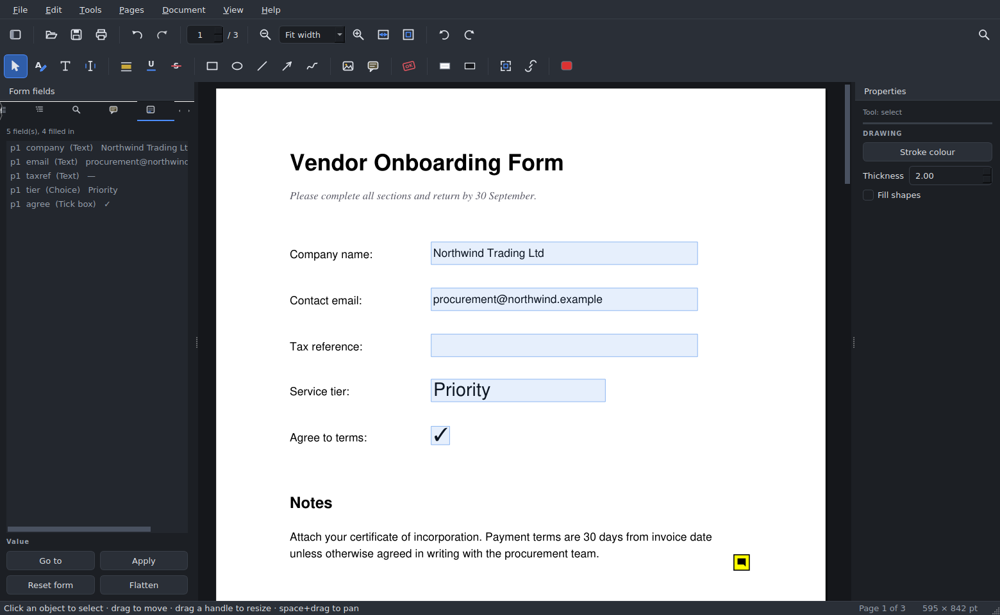

# PDF Studio

A free, open-source desktop PDF editor that builds into a single executable —
an Acrobat-Pro-class tool with no subscription, no account, and no uploads.
Everything runs locally on your machine.

**Text is genuinely editable.** Click into a paragraph, get a real caret, and
type. Text reflows as you go, and when you're done the words are written back
in the document's own font — including fonts embedded in the file, not a
generic substitute.

### ⬇️ [**Download the app**](../../releases/latest)

Grab the `.zip` for your platform from the latest release, unzip it, and run it.
No installer, no Python, no account, no internet connection needed.



## Features

**Editing text in place**
- Click any text to put a caret in it and start typing
- Full keyboard editing: arrows, word-jump (Ctrl+←/→), Home/End, shift-select,
  double-click a word, Ctrl+A, cut/copy/paste, undo
- Live reflow with real glyph metrics — the line breaks the way it will save
- **Drag a text block** anywhere on the page by its handle bar
- **Resize the wrap width** with the round grip; the paragraph re-wraps live
- Restyle while editing: font family, size, **bold** (Ctrl+B), *italic*
  (Ctrl+I), colour — applied to a selection or to what you type next
- Add brand-new text boxes anywhere with the Text tool
- Original typeface is preserved on save, embedded fonts included

**Filling in forms**
- Fillable PDFs are detected and every field is tinted so you can see them
- Click a field and type; tick boxes toggle on click; dropdowns offer their choices
- Tab moves to the next field in reading order
- A Form panel lists every field with its value, and can jump to any of them
- **Reset** clears the whole form; **Flatten** burns the answers in so the
  form can no longer be edited or re-submitted

**Annotation and markup**
- Highlight, underline, strike out (drag across text — it snaps to words)
- Rectangles, ellipses, lines, arrows, freehand ink, with colour and thickness
- Sticky notes and image stamps (drop in a signature, logo or photo)
- **Stamps** — APPROVED, DRAFT, CONFIDENTIAL and friends, or type your own
- A **Comments panel** listing every annotation in the document: filter by
  kind, click to jump to it, read and edit its note, delete it
- Click any object to select it, drag to move, drag a corner handle to resize,
  Delete to remove
- **Flatten annotations** to bake them permanently into the page
- **Whiteout** erases an area to white; **Redact** permanently removes the
  content and fills it black
- Undo/redo across every operation

**A window that looks the part**
- Custom-drawn window chrome: the menus live in the title bar beside the app
  icon, with hand-drawn minimise / maximise / close buttons — no stock OS frame
- Everything a native frame does still works: drag the bar (or empty menu
  space) to move, drag any edge or corner to resize, double-click to maximise,
  right-click for the window menu; dragging a maximised window restores it
  under the cursor
- The title shows the open document with a ● when there are unsaved changes
- F11 full screen. On macOS the native frame is kept (that platform's
  conventions); set `PDFSTUDIO_NATIVE_FRAME=1` to force the native frame
  anywhere

**Reading and navigation**
- Three view modes: continuous scroll, one page at a time, or a two-page spread
- **Night mode** inverts the page for reading in the dark
- Thumbnail sidebar, whole-document search with match-case / whole-word
- **Snapshot** tool copies any region of the page to the clipboard as an image
- Clickable links are followed; make your own with the Link tool

**Bookmarks**
- Add, rename, delete and re-indent bookmarks — not just follow them
- **Generate a contents list automatically** by finding the headings in a
  document that has none

**Reducing file size**
- **Reduce File Size** (Ctrl+Shift+C) analyses the document first and tells you
  where its weight actually is before you commit to anything
- Five presets from lossless reorganising up to 72 dpi greyscale, or set the
  image resolution and JPEG quality yourself
- Optional font subsetting, metadata stripping and annotation flattening
- Text, vector graphics and layout are never touched — only images are resampled
- The result is applied to the open document so you can inspect the quality, and
  Undo puts the originals back. On an image-heavy file expect **90%+ smaller**
- It will never hand you a *bigger* file: if there is nothing to reclaim it says
  so and leaves the document alone

**Pages and documents**
- Rotate, delete, reorder (drag thumbnails), insert blank pages
- Merge another PDF in, or extract pages out to a new file
- **Split** a document — every N pages, by custom ranges, or at each bookmark
- **Crop** pages to a region you drag, and reset it again
- **Insert images as pages**, so a folder of scans becomes a PDF
- **Attach files** inside the PDF, and extract them again
- Watermarks, printed page numbers, and reader page labels (i, ii, A-1…)
- Create new PDFs (A4 / Letter / Legal)
- Save with AES-256 password protection, or save an optimised (smaller) copy
- Print, export a page as an image, export all text
- Opens password-protected files; drag and drop a PDF onto the window

## Getting the app

### Option A — download a prebuilt executable (easiest)

Go to **[Releases](../../releases/latest)**
and download the zip for your platform. No GitHub account needed.

| Platform | File | Run |
|---|---|---|
| Windows | `PDFStudio-…-Windows.zip` | `PDFStudio.exe` |
| macOS | `PDFStudio-…-macOS.zip` | `PDFStudio` |
| Linux | `PDFStudio-…-Linux.zip` | `PDFStudio` |

Each release ships `SHA256SUMS.txt` so you can verify a download against what
CI produced.

On macOS you get a double-clickable **PDFStudio.app** with the proper icon;
on Windows the .exe carries the app icon and full version metadata.

Unless a signing certificate has been configured for the releases (see
SECURITY.md), the first launch needs one extra click:
**Windows** — SmartScreen warns, choose *More info → Run anyway*.
**macOS** — right-click the app, choose *Open*, then confirm.

(Every push also builds executables as Actions artifacts, but those need a
signed-in GitHub account and expire after 90 days — releases are the ones to
share.)

### Option B — build it yourself

1. Install Python 3.10–3.12 from [python.org](https://www.python.org/downloads/)
   (tick **"Add python.exe to PATH"**).
2. Double-click **`build.bat`** (Windows) or run **`./build.sh`** (Linux/macOS).
3. The executable appears in **`dist/`**.

### Option C — run from source

```bash
pip install --require-hashes --only-binary :all: -r requirements.lock
python main.py [file.pdf]
```

## Keyboard shortcuts

| Keys | Action |
|---|---|
| Ctrl+O / Ctrl+S / Ctrl+Shift+S | Open / Save / Save As |
| Ctrl+Z / Ctrl+Shift+Z | Undo / Redo |
| Ctrl+F / F3 / Shift+F3 | Find / next / previous |
| Ctrl+B / Ctrl+I | Bold / italic while editing text |
| Esc | Finish editing a text block |
| Ctrl+← / Ctrl+→ | Move the caret a word at a time |
| Ctrl+A | Select all (in the text block, or the page's text) |
| PgUp / PgDown, Ctrl+Home / Ctrl+End | Page navigation |
| Ctrl++ / Ctrl+- / Ctrl+0 | Zoom in / out / 100% |
| Ctrl+1 / Ctrl+2 | Fit width / fit page |
| Ctrl+scroll | Zoom around the pointer |
| Space+drag, or middle-drag | Pan |
| Del | Delete the selected object |
| Ctrl+M / Ctrl+P | Insert-merge a PDF / Print |
| Ctrl+Shift+C | Reduce file size |
| Ctrl+3 / Ctrl+4 / Ctrl+5 | Continuous / single page / two-page spread |
| Ctrl+D | Night mode |
| Tab | Next form field |
| F11 | Full screen |
| F9 / F10 | Toggle sidebar / properties panel |

## How it works

The parts that make a PDF editor an *editor* are written from scratch here:

| Module | Responsibility |
|---|---|
| `textengine.py` | Character model, word-wrap layout, caret, selection, editing operations |
| `fonts.py` | Font resolution, exact glyph measurement, embedded-font extraction and re-embedding |
| `canvas.py` | Continuous page canvas, all direct manipulation and live text rendering |
| `document.py` | Document model, undo/redo, and the commit path back into the PDF |
| `doc_features.py` | Forms, bookmarks, links, attachments, stamps, page surgery |
| `panels.py` / `theme.py` / `icons.py` | Sidebar, inspector, dark theme, runtime-drawn icons |
| `titlebar.py` | Frameless window chrome: title bar, window buttons, drag and edge-resize |
| `tools/make_icon.py` | Renders the app icon into .ico / .icns / .png with hand-written containers |

Editing text works by rebuilding the structure a PDF throws away. Characters
are extracted with their individual bounding boxes and styles, laid out again
with the real glyph advances of the original font, edited like an ordinary text
field, then written back: the original glyphs are erased with a text-only
redaction and the new layout is drawn in the same typeface at the same size and
colour.

The only third-party runtime pieces are Qt (the windowing toolkit) and MuPDF
(the PDF parser/rasteriser) — the equivalent of the operating system for this
kind of app. No PDF-editing library is doing the work.

## Tests

```bash
python tests/test_document.py                        # document engine
python tests/test_textengine.py                      # layout / caret / commit fidelity
python tests/test_features.py                        # forms, bookmarks, links, split…
python tests/test_compress.py                        # file-size reduction
python tests/test_packaging.py                       # icon containers, spec, signing hooks
QT_QPA_PLATFORM=offscreen python tests/test_gui.py   # GUI with synthesized input
```

The GUI test drives the real window with synthesized mouse and keyboard events:
clicking into text, typing, dragging a text block, clicking a form field and
filling it, ticking a checkbox, drawing and resizing shapes, switching view
modes, taking a snapshot, compressing a file, and searching. All six suites run in CI on every
platform before the executable is built.

## Limitations worth knowing

- Re-typed text is laid out by this application, not by whatever produced the
  original PDF. Heavily designed pages (multi-column, tight kerning, justified
  text) can shift slightly. Corrections, rewrites and retitling are reliable;
  reflowing a magazine layout is not.
- If a paragraph grows, following lines move down and may overlap content
  beneath. That is inherent to editing text in a fixed-layout format.
- Whiteout and redaction are permanent once saved — that is the point — but
  undo works right up until you save.
- Digital signatures are not implemented — you can place a signature *image*
  with the Image tool, but not a cryptographic signature.
- Scanned PDFs are images, so their text is not searchable or editable. There
  is no OCR built in.

## Security and corporate deployment

The app makes **no network connections of any kind** — no telemetry, no update
check, no licence check, no account. Qt's networking module is excluded from
the build entirely. Everything it needs is sealed inside the single executable,
so it runs on an air-gapped machine.

Dependencies are pinned by exact version and SHA-256 in `requirements.lock`,
and CI installs with `--require-hashes --only-binary :all:`. If a package's
contents differ by a single byte — a hijacked maintainer account, a poisoned
mirror — the build fails instead of shipping. A separate CI job runs
`pip-audit` against the pinned versions on every push.

See **[SECURITY.md](SECURITY.md)** for the full review notes, including the
two things a reviewer should weigh: the executable is unsigned, and PyMuPDF is
AGPL-licensed.

## Licence and contributions

AGPL-3.0 — see [LICENSE](LICENSE). This licence is required because the app
links MuPDF (via PyMuPDF). The app is free to use and share, and its source
stays available, which it is, right here.

This repository is public to read but not open to direct changes. Nobody
outside the repository owner can push to it. Anyone may read, clone or fork
the code, and may open an issue or a pull request — but a pull request is only
a proposal and changes nothing unless the owner reviews and merges it.
